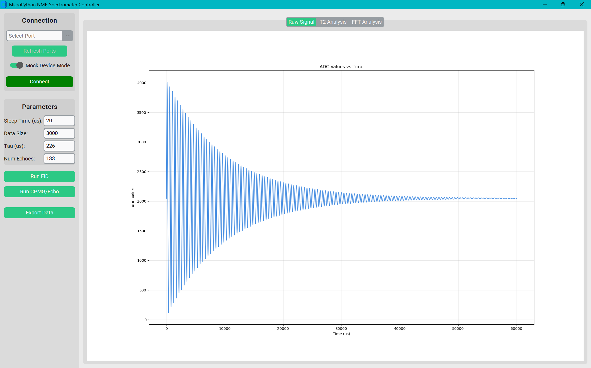
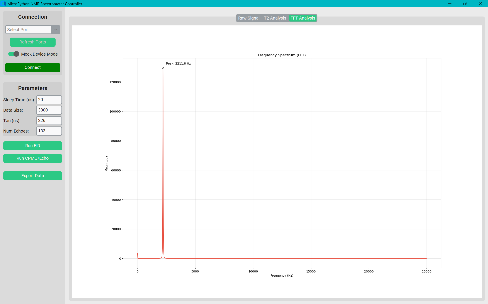
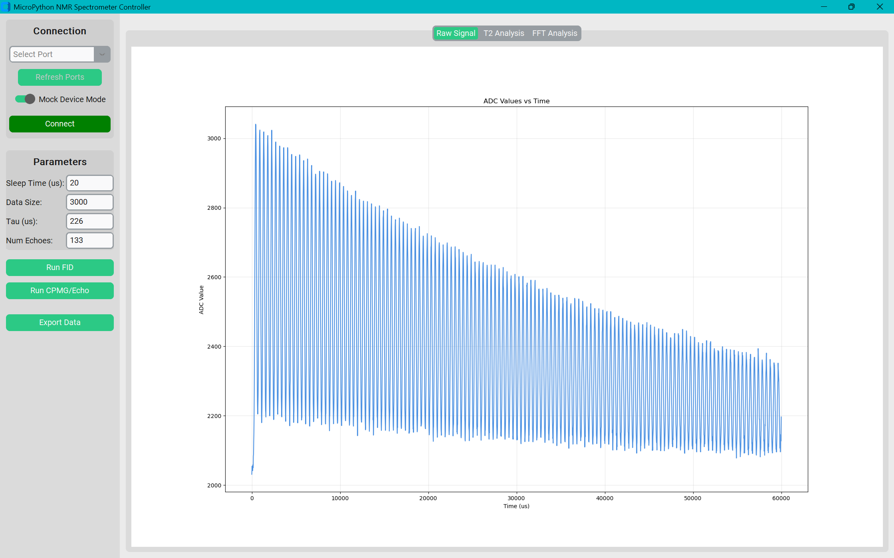
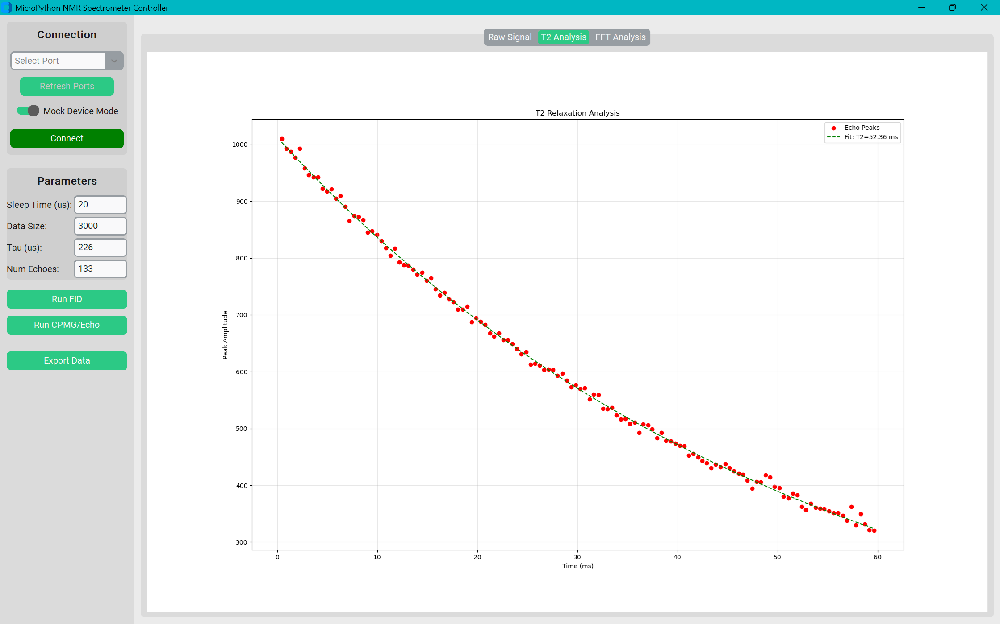
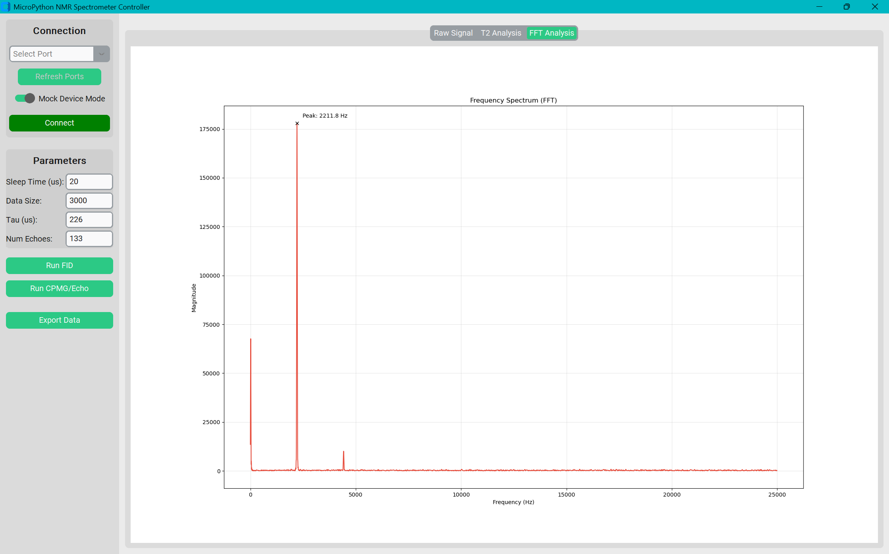

# Python NMR Spectrometer Controller

A standalone, pure-Python controller for Nuclear Magnetic Resonance (NMR) spectroscopy, running on the **Raspberry Pi Pico**.

This project implements a high-fidelity NMR pulse sequencer and data acquisition system using the advanced hardware features of the RP2040 microcontroller. It overcomes the timing jitter limitations of interpreted Python by offloading critical tasks to dedicated hardware accelerators.

## 🚀 Key Capabilities
*   **Deterministic Pulse Timing:** µs-accurate CPMG and FID sequences using PIO state machines.
*   **500ksps Data Acquisition:** Jitter-free ADC sampling via Direct Memory Access (DMA).
*   **Real-Time Analysis:** Custom Python GUI with built-in FFT spectroscopy and T2 relaxation fitting.

## 🛠️ Technical Architecture

### 1. The Timing Problem
In standard MicroPython, a command like `time.sleep_us(10)` is not precise. Background tasks, garbage collection, and interpreter overhead can introduce random delays (jitter) of 10-50µs. For NMR, where phase coherence is critical, a 10µs error at 2kHz causes a significant phase shift, destroying the spin echo train.

### 2. PIO (Programmable I/O) Solution
To solve this, we use the RP2040's **PIO** block. We load a custom assembly program into one of the PIO state machines.
*   **Independence:** Once started, the PIO runs independently of the main CPU. It executes one instruction per clock cycle (8ns at 125MHz).
*   **Sideset Pins:** The pulses are driven by "sideset" instructions (e.g., `nop().side(1)`), guaranteeing that the pin transitions occur exactly when the instruction executes.
*   **Synchronisation:** The PIO triggers the acquisition window, ensuring the ADC starts capturing exactly when the echo is expected.

### 3. DMA (Direct Memory Access) Pipeline
Capturing data at 500,000 samples per second is too fast for a Python loop (`while True: adc.read()`).
To achieve this, we implement a hardware pipeline:
1.  **ADC FIFO:** The ADC is set to free-running mode, pushing results into a hardware FIFO.
2.  **DREQ (Data Request):** When the FIFO contains data, it asserts a "Transfer Request" signal.
3.  **DMA Channel:** A configured DMA channel sees this request and instantly moves the data from the ADC FIFO to a pre-allocated bytearray in RAM.

This process happens without *any* CPU intervention, ensuring perfectly uniform sampling intervals essential for clean Fourier Transforms.

### 4. Signal Processing & FFT
The accompanying GUI performs advanced signal processing to extract the Larmor frequency:
*   **DC Offset Removal:** Subtracts the mean voltage to center the signal at 0.
*   **Windowing:** Applies a **Hanning Window** to the time-domain data. This tapers the signal edges to zero, significantly reducing "spectral leakage" (side lobes) in the frequency domain.
*   **Zero-Filling:** The data is padded with zeros to 4x its original length before the FFT. This interpolates the frequency spectrum, creating a smoother curve and allowing for more precise peak detection.
*   **FFT:** A Fast Fourier Transform reveals the spectral composition, allowing users to pinpoint the exact resonance frequency (e.g., 2210 Hz).

---

## User Interface
### Free Induction Decay (FID)

### Carr-Purcell-Meiboom-Gill (CPMG)

## 🛠️ Hardware Map 
The firmware directly manipulates the following GPIOs based on the specific NMR operational needs:

| Pin | Function | Description |
| :--- | :--- | :--- |
| **GP16** | `PULSE_PIN` | **TX:** Drives the H-Bridge for RF excitation pulses. Controlled by PIO. |
| **GP26** | `PP_COIL_PIN` | **Polarisation:** Switches the high-current relay for the Pre-Polarisation coil. |
| **GP22** | `DET_SWITCH_PIN` | **RX Isolation:** Disconnects the receiver during high-voltage pulses. |
| **GP28** | `ADC_PIN` | **RX Input:** Analog input from the low-noise pre-amplifier. |

## Licence & Usage

Copyright (c) 2026 Sajid Ahmed. **All Rights Reserved.**

This repository is strictly for **portfolio review and recruitment purposes**.

### Use Constraints:
* **No Unauthorised Distribution:** You may not redistribute, sublicense, or sell any part of this source code.
* **No Commercial Use:** This software may not be used for any commercial or production purposes.
* **AI & Machine Learning Restriction:** Use of this source code, in whole or in part, for the purpose of training, fine-tuning, or validating machine learning or artificial intelligence models (including but not limited to LLMs and generative AI) is **strictly prohibited** without express written permission from the author.
* **Viewing & Forking:** Permission is granted to view the source code and fork the repository on GitHub for the purpose of personal review only.

The software is provided **" as is "**, without warranty of any kind.
*See the [LICENSE](LICENSE) file for the full legal text.*
